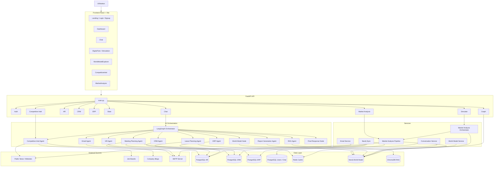
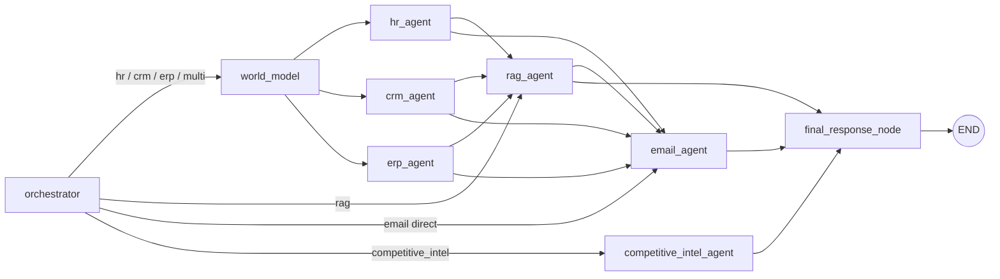
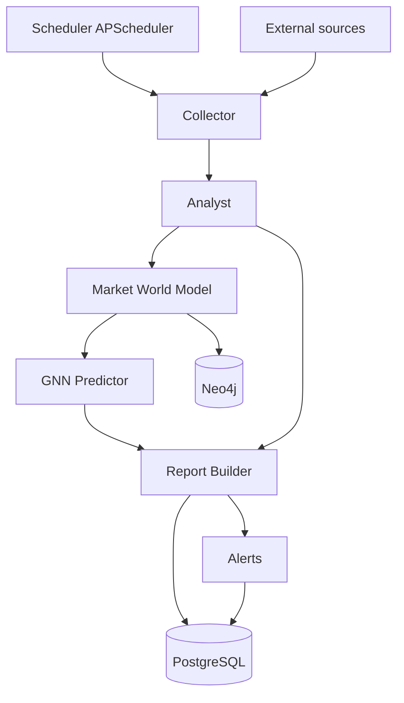

# Architecture Complete du Projet

Cette documentation presente une vue complete, claire et exploitable de la plateforme:
les couches, les agents, les services, les donnees et les pipelines autonomes.

## 1. Vue globale

Le projet est organise en 5 grands blocs:

1. **Presentation**: frontend React + Vite.
2. **API**: FastAPI, auth, routes metiers et streaming.
3. **IA / Agents**: orchestration LangGraph, agents specialises, RAG.
4. **Services et domain logic**: conversation, world model, neo4j sync, market analysis.
5. **Donnees et infra**: PostgreSQL, Neo4j, Redis, ChromaDB, Docker.

## 2. Schema global

## 3. Couche frontend

Le frontend est une SPA React.

### Pages principales

- `Landing`, `Login`, `Signup` pour l acces public.
- `Dashboard`, `Chat`, `DigitalTwin`, `Simulation`, `WorldModelExplorer`, `CompetitiveIntel`, `MarketAnalysis` pour les espaces proteges.

### Architecture frontend

- `frontend/src/main.tsx` demarre l application.
- `frontend/src/App.tsx` gere le routing public / protege.
- `frontend/src/stores/authStore.ts` conserve l etat d authentification.
- `frontend/src/hooks/useChat.ts` pilote le chat et le streaming.
- `frontend/src/api/*` centralise les appels API.
- `frontend/src/components/*` regroupe les widgets metiers et UI.

### Role du frontend

- capturer les besoins utilisateur;
- afficher les dashboards metiers;
- consommer les APIs backend;
- visualiser le graphe Neo4j;
- afficher les resultats du chat en streaming.

## 4. Couche API

Le backend est une API FastAPI.

### Point d entree

- `backend/app/main.py`

### Responsabilites de `main.py`

- creation des tables au demarrage;
- lancement du scheduler Neo4j;
- lancement du pipeline market analysis;
- enregistrement des routers;
- exposition de `/health` et `/`.

### Routers exposes

- `auth` -> register, login, profil.
- `chat` -> assistant conversationnel en streaming.
- `hr` -> CRUD et KPIs RH.
- `crm` -> CRUD et KPIs commerciaux.
- `erp` -> CRUD et KPIs financiers.
- `stats` -> KPIs agreges par role.
- `graph` -> exploration du world model.
- `simulate` -> digital twin et simulation.
- `competitive_intel` -> veille concurrentielle.
- `market_analysis` -> pipeline marche et KG.

### Securite

- JWT Bearer pour les routes protegees.
- RBAC par role: `admin`, `manager`, `employee`.

## 5. Couche agents IA

Le noyau IA est base sur LangGraph.

### Graph principal

Fichier: `backend/app/agents/graph.py`

### Noeuds du graphe

- `orchestrator`
- `world_model`
- `hr_agent`
- `crm_agent`
- `erp_agent`
- `rag_agent`
- `email_agent`
- `competitive_intel_agent`
- `final_response_node`

### Logique de routage

1. `orchestrator` classifie la demande.
2. Le routeur envoie vers:
   - `world_model` puis un agent metier pour `hr`, `crm`, `erp`, `multi`.
   - `rag_agent` si la requete est documentaire.
   - `email_agent` si le message demande un envoi direct.
   - `competitive_intel_agent` pour la veille concurrentielle.
3. `final_response_node` synthese la reponse finale.

### AgentState partage

Fichier: `backend/app/agents/state.py`

Champs principaux:

- `messages`
- `user_id`
- `user_role`
- `detected_domain`
- `domain_confidence`
- `tool_results`
- `rag_context`
- `final_response`
- `requires_write`
- `requires_email`
- `requires_report`
- `email_result`
- `error_message`
- `iteration_count`
- `secondary_domain`
- `world_model_snapshot`

## 6. Agents specialises

### Orchestrator

Fichier: `backend/app/agents/orchestrator.py`

Role:

- classifier l intention;
- detecter le domaine principal;
- detecter si la requete requiert ecriture, email ou rapport;
- orienter vers le bon agent.

### World model node

Fichier: `backend/app/agents/graph.py`

Role:

- charger un snapshot Neo4j du domaine concerne;
- enrichir le contexte des agents HR, CRM et ERP.

### HR Agent

Fichier: `backend/app/agents/hr_agent.py`

Role:

- interroger les donnees RH;
- repondre aux questions employees / manager / direction;
- exploiter le world model.

### CRM Agent

Fichier: `backend/app/agents/crm_agent.py`

Role:

- traiter les questions commerciales;
- analyser comptes, contacts, opportunites et revenus;
- exploiter le world model.

### ERP Agent

Fichier: `backend/app/agents/erp_agent.py`

Role:

- traiter les sujets financiers et operationnels;
- interroger factures, paiements, commandes et fournisseurs;
- exploiter le world model.

### RAG Agent

Fichier: `backend/app/agents/rag_agent.py`

Role:

- faire le retrieval documentaire;
- combiner recherche vectorielle et BM25;
- fournir un contexte documentaire au final prompt.

### Email Agent

Fichier: `backend/app/agents/email_agent.py`

Role:

- rediger un email professionnel;
- extraire le destinataire;
- envoyer via SMTP;
- enregistrer le resultat dans `email_result`.

### Competitive Intel Agent

Fichier: `backend/app/agents/competitive_intel_agent.py`

Role:

- surveiller les signaux publics;
- analyser les news, jobs et blogs;
- produire une synthese strategique.

### Simulator Agent

Fichier: `backend/app/agents/simulator_agent.py`

Etat:

- present dans le projet;
- encore partiellement branche;
- alimente la logique de simulation strategique.

## 7. Services transverses

### Conversation Service

Fichier: `backend/app/services/conversation_service.py`

Role:

- persister l historique chat;
- synchroniser PostgreSQL et Redis;
- gerer la lecture et la suppression des conversations.

### Email Service

Fichier: `backend/app/services/email_service.py`

Role:

- encapsuler l envoi SMTP;
- etre appele par l agent email.

### World Model Service

Fichier: `backend/app/services/world_model_service.py`

Role:

- fournir un snapshot Neo4j rapide;
- eviter qu une indisponibilite Neo4j casse le pipeline.

### Neo4j Sync

Fichier: `backend/app/services/neo4j_sync.py`

Role:

- synchroniser PostgreSQL vers Neo4j;
- maintenir le world model a jour.

### Market Analysis

Fichiers:

- `backend/app/services/market_analysis/collector.py`
- `backend/app/services/market_analysis/analyst.py`
- `backend/app/services/market_analysis/world_model.py`
- `backend/app/services/market_analysis/gnn_predictor.py`
- `backend/app/services/market_analysis/orchestrator.py`

Role:

- collecte de sources externes;
- analyse causale;
- mise a jour du KG marche;
- prediction GNN;
- generation d alertes et de rapports.

## 8. Donnees et stockage

### PostgreSQL

Trois bases principales:

- `hr`
- `crm`
- `erp`

Schema supplementaire:

- `users`
- `chat_*`
- tables market analysis stockees dans la base HR pour ce projet.

### Redis

- cache conversationnel;
- acceleration de lecture;
- couche temporaire, pas une source de verite.

### Neo4j

- world model entreprise;
- relations HR / CRM / ERP;
- enrichissement des agents;
- support du graphe de connaissance marche.

### ChromaDB

- documents RAG;
- policies;
- procedures;
- connaissances internes.

## 9. Pipelines autonomes

### Chat conversationnel

Flux:

1. le frontend envoie le message.
2. `POST /api/v1/chat`.
3. `initial_state` cree le contexte LangGraph.
4. `run_agent_graph` execute le pipeline.
5. la reponse est streammee en SSE.
6. la conversation est persistee.

### World model / graph

Flux:

1. les donnees HR, CRM et ERP sont synchronisees.
2. Neo4j consolide les relations metiers.
3. le frontend visualise le graphe via `/api/v1/graph`.

### Veille concurrentielle

Flux:

1. le router `competitive_intel` appelle l agent specialise.
2. les sources publiques sont scrappees.
3. une synthese strategique est produite.

### Market analysis

Flux:

1. le scheduler declenche le pipeline.
2. la collecte recupere news et prix.
3. l analyse LLM extrait les signaux causaux.
4. le KG marché est mis a jour.
5. le GNN produit les risques caches.
6. les alertes et rapports sont stockes.

## 10. Schema du graphe LangGraph

## 11. Schema du pipeline market analysis

## 12. Infra et execution

- `infra/docker-compose.yml` orchestre les services.
- `backend/Dockerfile` construit l API.
- `frontend/Dockerfile` construit l interface.
- `start_backend.bat` et `start_frontend.bat` facilitent le lancement local.

## 13. Resume tres court

En une phrase:

**Frontend React -> FastAPI -> LangGraph agents -> services metiers -> PostgreSQL / Neo4j / Redis / ChromaDB -> reponse finale ou pipeline strategique.**
