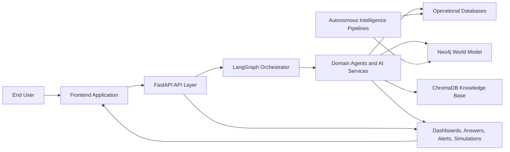
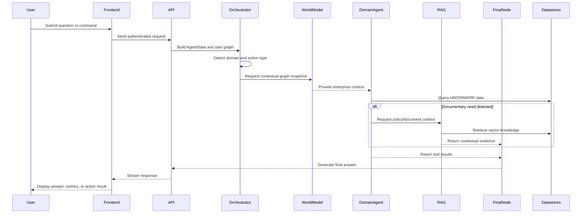
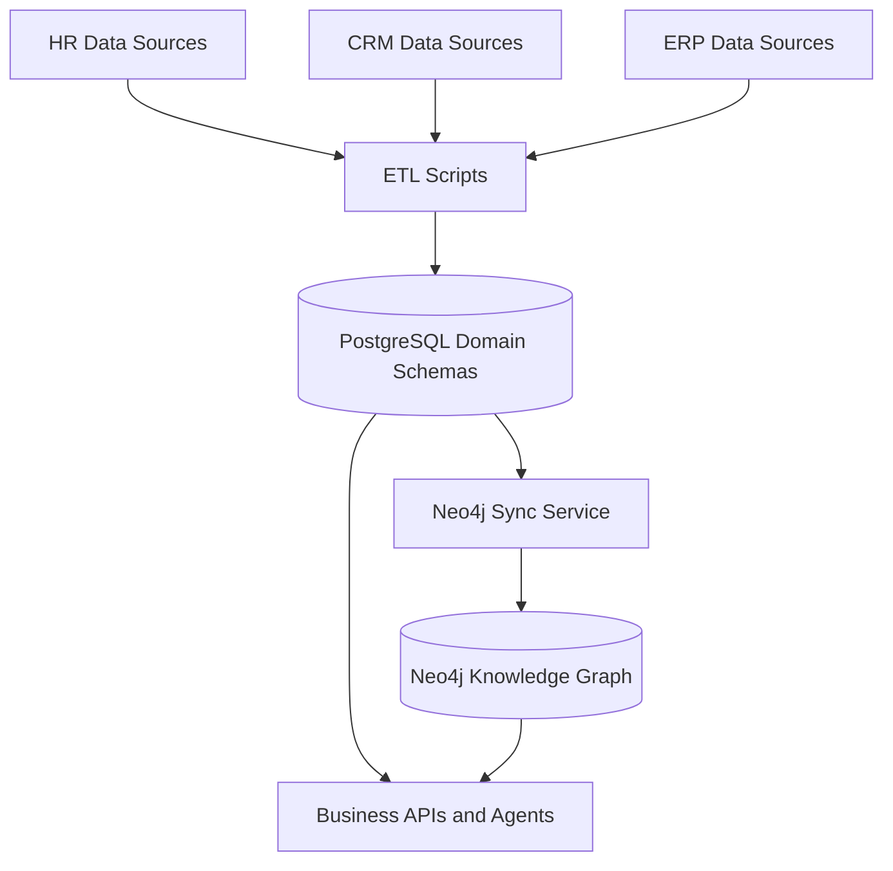
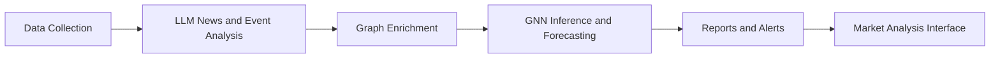
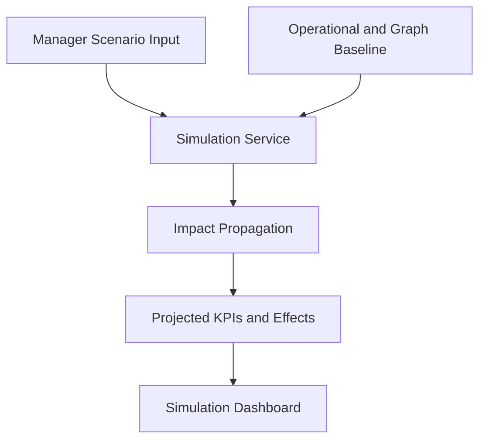
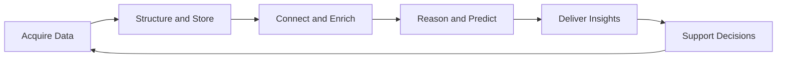

# Final Year Project Workflow Architecture

## 1. Purpose

This document defines the complete professional workflow architecture of the **Talan Intelligent Enterprise Assistant**, a full-stack AI platform developed as a Final Year Project. The architecture explains how the system transforms raw enterprise and external data into secure, explainable, and actionable business intelligence for end users.

The workflow is designed around six architectural goals:

1. Centralize fragmented enterprise data from HR, CRM, and ERP domains.
2. Provide a natural-language interaction layer through a multi-agent AI assistant.
3. Maintain a shared enterprise world model using graph-based knowledge representation.
4. Continuously enrich the platform with autonomous market analysis and competitive intelligence.
5. Support simulation and strategic decision-making for managers and executives.
6. Ensure security, traceability, modularity, and deployment readiness.

---

## 2. High-Level Workflow View

At runtime, the platform behaves as a closed decision loop:

1. Data is collected from internal and external sources.
2. Data is stored, synchronized, and semantically enriched.
3. AI agents interpret user intent and retrieve the required evidence.
4. The system generates contextual responses, insights, alerts, or simulations.
5. Users consume outputs through dashboards and conversational interfaces.

---

## 3. Architectural Layers

## 3.1 Presentation Layer

The presentation layer is the React and TypeScript frontend. It is responsible for user access, role-aware navigation, data visualization, and chat interaction.

Main responsibilities:

- authenticate users and maintain sessions;
- expose protected business pages;
- render dashboards, graphs, alerts, and predictions;
- stream AI responses from the backend;
- provide interaction entry points for CRUD, analytics, and simulation.

Main frontend modules:

- `Landing`, `Login`, `Signup`
- `Dashboard`
- `Chat`
- `DigitalTwin`
- `Simulation`
- `WorldModelExplorer`
- `CompetitiveIntel`
- `MarketAnalysis`

## 3.2 API and Application Layer

The API layer is implemented with FastAPI and acts as the controlled gateway between the user interface and the platform services.

Key responsibilities:

- authentication and authorization;
- domain routing for HR, CRM, ERP, graph, simulation, and AI chat;
- request validation and response serialization;
- orchestration startup for background services;
- exposure of health and operational endpoints.

Principal API groups:

- `/api/v1/auth`
- `/api/v1/chat`
- `/api/v1/hr`
- `/api/v1/crm`
- `/api/v1/erp`
- `/api/v1/stats`
- `/api/v1/graph`
- `/api/v1/simulate`
- `/api/v1/competitive-intel`
- `/api/v1/market-analysis`

## 3.3 Intelligence and Orchestration Layer

The intelligence layer is centered on **LangGraph** and specialized AI agents. It receives a user request, classifies intent, gathers evidence, and synthesizes the final response.

Core components:

- `orchestrator_node`
- `world_model_node`
- `hr_agent`
- `crm_agent`
- `erp_agent`
- `rag_agent`
- `email_agent`
- `competitive_intel_agent`
- `final_response_node`

## 3.4 Service Layer

The service layer provides reusable business capabilities outside direct routing logic.

Main services:

- `conversation_service`
- `world_model_service`
- `neo4j_sync`
- `email_service`
- `market_analysis.orchestrator`
- `competitive_intel.scanner`

## 3.5 Data Layer

The data layer combines relational, graph, cache, and vector storage.

- **PostgreSQL** for HR, CRM, ERP, users, chat history, and pipeline results.
- **Neo4j** for enterprise relationship modeling and graph exploration.
- **Redis** for cache and session-oriented operational support.
- **ChromaDB** for retrieval-augmented generation over enterprise documentation.

## 3.6 Infrastructure Layer

The infrastructure layer packages the platform into containerized services for local development and deployment.

Main infrastructure services:

- FastAPI backend
- React frontend
- PostgreSQL
- Neo4j
- Redis
- Adminer
- Docker Compose orchestration

---

## 4. End-to-End User Request Workflow

The most important runtime workflow is the handling of a user request through the AI assistant.

### Processing stages

1. **Interaction initiation**
   The user sends a natural-language request through the chat page or another business screen.

2. **Access control**
   The backend validates the JWT token and determines the role of the user.

3. **Intent orchestration**
   The LangGraph orchestrator classifies the request into one of the supported domains such as HR, CRM, ERP, RAG, multi-domain, or competitive intelligence.

4. **Context enrichment**
   If the request concerns operational domains, the `world_model_node` retrieves a domain-scoped Neo4j snapshot to enrich downstream reasoning.

5. **Domain execution**
   The corresponding domain agent executes controlled tool usage against the relevant PostgreSQL schema.

6. **Knowledge augmentation**
   If documentary intent is detected, the RAG agent retrieves policy and reference material from ChromaDB.

7. **Response synthesis**
   The final node consolidates tool outputs, graph context, and retrieved documents into a coherent business answer.

8. **Delivery**
   The frontend receives and displays the final response, often alongside charts, graph views, or decision-support panels.

---

## 5. Enterprise Data Integration Workflow

The platform is built around the idea that enterprise intelligence depends on clean and connected data. The integration workflow therefore structures how data is ingested, normalized, and exposed.

### Integration logic

1. Domain data is extracted from structured business sources.
2. ETL scripts transform records into consistent relational structures.
3. Cleaned data is loaded into dedicated PostgreSQL schemas.
4. A synchronization service projects critical entities and relationships into Neo4j.
5. Agents and analytical services consume both relational data and graph context.

### Architectural value

- PostgreSQL preserves transactional clarity and CRUD support.
- Neo4j exposes cross-domain relationships and enterprise topology.
- The combined model improves explainability and strategic analysis.

---

## 6. Conversational AI Workflow

The conversational workflow is the operational heart of the project and translates unstructured user intent into structured business actions.

## 6.1 Orchestration logic

The orchestrator performs:

- domain classification;
- confidence estimation;
- action type detection;
- permission-aware routing;
- fallback handling for ambiguous requests.

## 6.2 Agent execution pattern

Each domain agent follows a controlled reasoning-and-tool pattern:

1. interpret the business need;
2. choose the right tool or query strategy;
3. execute the tool against the authorized dataset;
4. inspect returned evidence;
5. decide whether another iteration is needed;
6. return a concise structured result.

## 6.3 Multi-source response synthesis

The final answer may combine:

- relational records from PostgreSQL;
- graph context from Neo4j;
- documentary context from ChromaDB;
- external intelligence signals where applicable.

This creates a professional response layer that is not limited to simple Q and A, but supports analysis, justification, and recommendation.

---

## 7. Market Analysis Workflow

The market analysis module is an autonomous intelligence pipeline that transforms external market signals into strategic recommendations.

### Detailed stages

1. **Collection**
   Market data is gathered from financial and public information sources.

2. **Semantic analysis**
   LLM-based processing extracts entities, causes, trends, sentiment, and potential business impact.

3. **Knowledge graph update**
   The system updates graph structures to represent events, entities, and causal links.

4. **Graph neural prediction**
   GNN models such as GAT, TGN, HGT, and HTGN analyze graph structure and temporal evolution to generate predictions.

5. **Decision-support output**
   Alerts, recommendations, and analytical summaries are stored and presented to the user.

### Strategic contribution

This workflow elevates the project from an internal assistant to a proactive strategic platform capable of anticipating market changes instead of merely reporting them.

---

## 8. Competitive Intelligence Workflow

The competitive intelligence module continuously monitors external organizations and transforms weak signals into actionable risk awareness.

### Workflow stages

1. scan public sources such as news outlets, job boards, and company channels;
2. detect relevant competitor events and hiring signals;
3. classify opportunity or threat level;
4. store snapshots and alerts;
5. present insights in the dedicated competitive intelligence interface.

### Outcomes

- threat radar visualization;
- recommendation cards;
- hiring trend detection;
- competitor event timelines.

This workflow complements market analysis by focusing specifically on rivals and strategic movements in the competitive landscape.

---

## 9. Digital Twin and Simulation Workflow

The digital twin workflow models the enterprise as an interconnected system and allows users to test strategic scenarios before implementation.

### Simulation objectives

- estimate the consequences of staffing or budgeting decisions;
- observe cross-domain effects on projects, finances, and teams;
- support managerial what-if analysis;
- reduce decision uncertainty through modeled outcomes.

This workflow gives the platform a prescriptive dimension, not only a descriptive one.

---

## 10. Security and Governance Workflow

Professional architecture requires governance at every stage of the workflow.

### Security controls

1. user registration and authentication through JWT;
2. role-based authorization for employee, manager, and admin profiles;
3. controlled routing of write-capable operations;
4. separation of domain datasets;
5. bounded tool access inside agents;
6. health checks and operational service supervision.

### Governance logic

- Employees can access their allowed data and basic operations.
- Managers receive wider visibility and controlled write capabilities.
- Admins retain full cross-domain authority.

This ensures the assistant remains useful without compromising enterprise control.

---

## 11. Deployment and Runtime Workflow

The deployment workflow organizes how the system starts, connects services, and launches autonomous background processes.

### Startup sequence

1. infrastructure services start through Docker Compose;
2. PostgreSQL, Redis, and Neo4j become available;
3. the FastAPI backend initializes tables and seeds required data;
4. schedulers and autonomous services are launched;
5. the frontend connects to the API and exposes the user interface.

### Runtime services started by the backend

- relational table creation;
- default admin bootstrap;
- scheduled Neo4j synchronization;
- market analysis orchestrator startup;
- competitive intelligence scanner startup.

### Operational outcome

The system is not only a request-response application. It also behaves as a semi-autonomous enterprise intelligence platform with continuous background activity.

---

## 12. Professional Workflow Architecture Summary

The complete workflow architecture can be summarized as a continuous intelligence cycle:

### Interpretation of the cycle

- **Acquire Data** through ETL and external intelligence collection.
- **Structure and Store** in PostgreSQL, Neo4j, Redis, and ChromaDB.
- **Connect and Enrich** via synchronization, world modeling, and semantic analysis.
- **Reason and Predict** with agents, LLMs, and graph learning models.
- **Deliver Insights** through chat, dashboards, alerts, and simulations.
- **Support Decisions** for operational users, managers, and executives.

---

## 13. Conclusion

The workflow architecture of this Final Year Project reflects a professional enterprise-grade design rather than a simple academic prototype. It combines:

- modular layered architecture;
- secure API-centered integration;
- multi-agent conversational intelligence;
- graph-based enterprise modeling;
- predictive market and competitor intelligence;
- simulation-driven strategic support;
- containerized deployment readiness.

As a result, the platform operates as an integrated decision-support ecosystem where data, AI, and business workflows converge into a single intelligent enterprise assistant.
